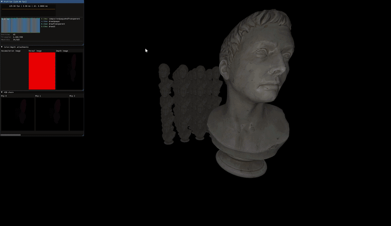
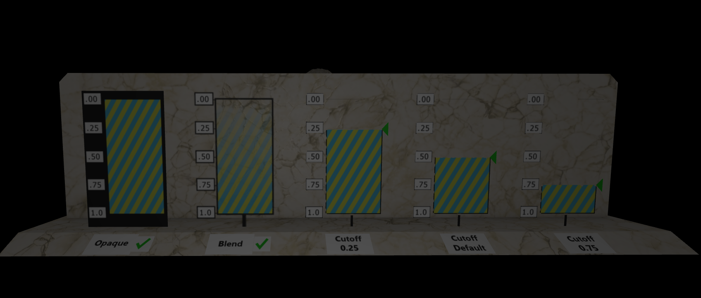

3D gpu driven renderer written from scratch with C++20 and Vulkan 1.3.
Task shader pipeline is used. For now I only implemented a working, somewhat scalable opaque pass and an accumulation pass with OIT. 
The goal is to render a big open-world scene with a lot of topology. Because the task shader pipeline is used, I have three types of culling: frustum, occlusion and backface (frustum + occlusion in the compute shader, and backface in the task + mesh shader). 
The renderer supports simple skeletal animations (for now it just loops each animation).

See the todo.




## Features

- Task shader pipeline Instanced rendering with LOD level selection in the compute shader.
- Two-phase HZB occlusion culling runs in compute.
- Order-independent transparency
- PBR metallic-roughness material workflow.
- Skeletal animation with per-meshlet culling for animated geometry (has bugs, see TODO).
- ECS architecture The scene is built on an ECS (EnTT).

## Used libraries

[vk-bootstrap](https://github.com/charles-lunarg/vk-bootstrap), VMA, [cgltf](https://github.com/jkuhlmann/cgltf), [meshoptimizer](https://github.com/zeux/meshoptimizer), [basis_universal](https://github.com/BinomialLLC/basis_universal), stb_image, [EnTT](https://github.com/skypjack/entt), [GLFW](https://github.com/glfw/glfw), [GLM](https://github.com/g-truc/glm), [Dear ImGui](https://github.com/ocornut/imgui), [coost](https://github.com/idealvin/coost), [spdlog](https://github.com/gabime/spdlog), [nlohmann/json](https://github.com/nlohmann/json)

## Building

Windows only for now.

1. Install the [Vulkan SDK](https://vulkan.lunarg.com).
2. Generate the Visual Studio 2026 solution with [premake5](https://premake.github.io/):

   ```
    premake5 --mode=sandbox vs2026
   ```

3. Open the generated solution and build in Release.

| Key | Action |
| --- | --- |
| `WASD`  | Controls |
| `M`  | Toggle cursor |
| `B` | Toggle debug camera to test culling |

## TODO

**In progress**
- Optimize ECS systems to run a LOT of animated objects. Now animated objects can stall game thread.

**Planned**
- Hard and soft shadows.
- Global illumination and reflections with radiance cascades.
- Post-processing.
- CPU-side Jolt physics.
- Optional: custom scene format with full ECS serialization, and gizmos.

**Known bugs**
- Flickering of meshlets because I have 3 frames in flight and they rewrite CMD buffers, need to implement per-frame-in-flight resource buffering.
